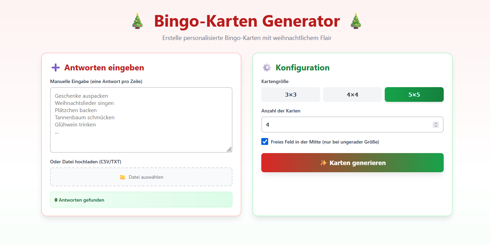

# Bingo-Karten-Generator

> Das hier ist ein eigenstehendes Tool zur Erstellung von personalisierten Bingokarten für eine Weihnachtsfeier.

Mit dem Tool sollen automatisch nach der Eingabe Bingo-Karten erstellt werden. Diese können anschließend als eine gesammelte PDF heruntergeladen werden und so für die Weihnachtsfeier gedruckt werden.

## ToDo's
 1. Seitenzahlen unten entfernen.
 2. Schriftgröße und Antwortverteilung im Feld anpassen
 3. PDF-Layout Weihnachtlich gestalten
 4. Statistik über das häufigst auftretende Bingo berechnen
 5. Wahrscheinlichkeit ausrechnen lassen, nach der wievielten Runde ein Bingo bei der Konstellation auftreten würde. Mit der Option, das 10, 20, 30, 40 % der generierten Karten nicht genutzt würden. 

